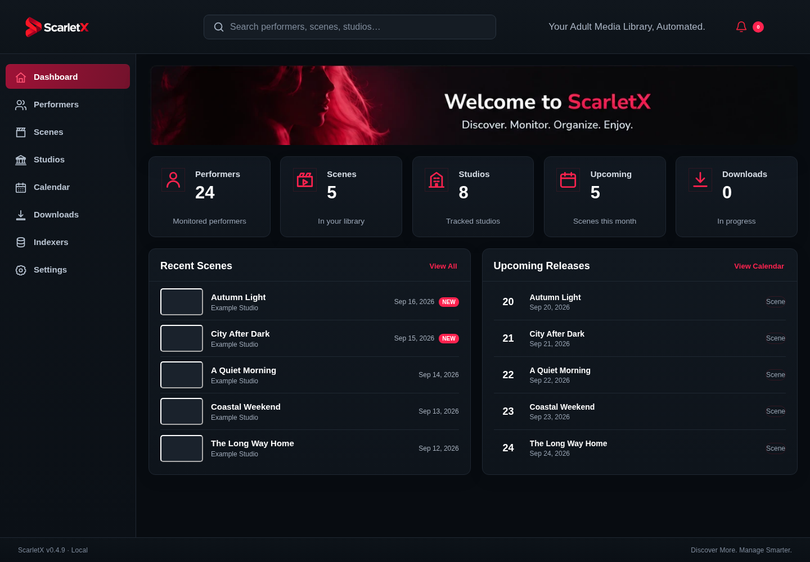
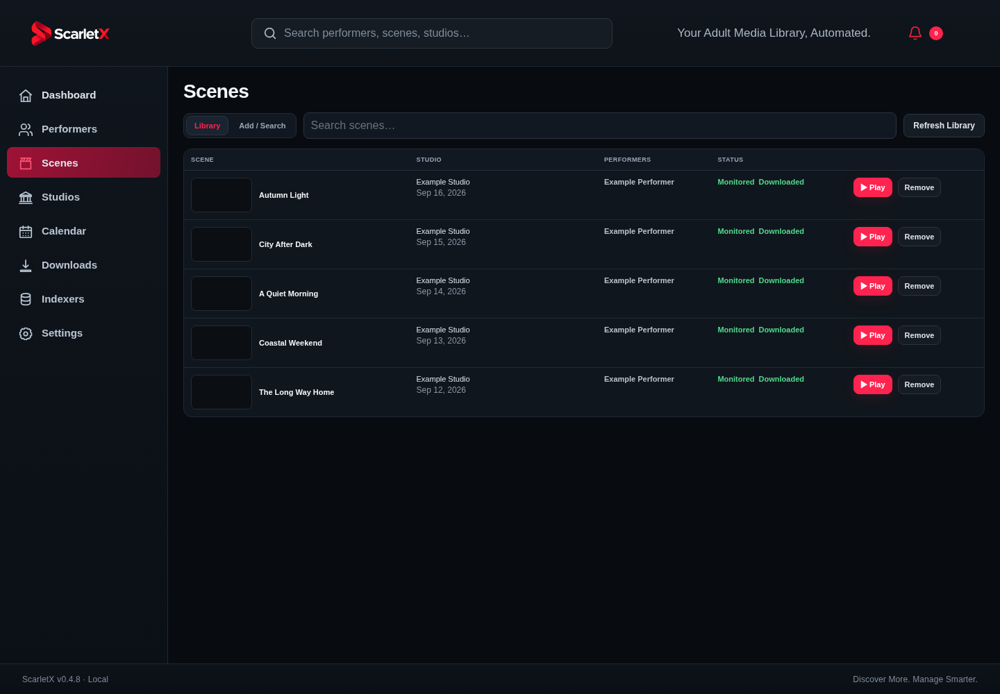

# ScarletX

[](https://github.com/terralayer/ScarletX/actions/workflows/tests.yml)
[](https://github.com/terralayer/ScarletX/actions/workflows/container.yml)
[](https://www.python.org/)
[](https://www.python.org/)
[](https://www.python.org/)
[](https://www.truenas.com/truenas-scale/)

ScarletX is a self-hosted adult scene manager and automation platform focused on scenes, performers, studios, monitoring, downloading, imports, metadata, and local-library playback.

It combines metadata management, automated acquisition, a built-in download workflow, post-processing, media organization, and a responsive web interface in one application.

## Interface

The current ScarletX interface uses a permanent dark charcoal theme with scarlet accents and a simplified Scarlet X identity.





## Highlights

- Adult-scene library management with scenes, performers, and studios
- TPDB metadata, artwork caching, and metadata refresh workflows
- Monitoring, Wanted tracking, release calendar, and automated acquisition
- Built-in download queue with live progress, speed, ETA, cancel, retry, failed-job handling, and completion history
- Stage-aware post-processing with PAR2 repair, archive extraction, and automatic import
- Background media scanning with FFprobe metadata, file fingerprints, duplicate detection, and missing-file tracking
- FFmpeg screengrabs, thumbnails, short previews, and browser playback with byte-range seeking
- Resume position, play count, favorites, and automatic indexing after import
- SQLite WAL mode and cached metadata/artwork for responsive large-library operation
- Docker deployment with persistent configuration, download, media, and backup storage
- TrueNAS SCALE as a primary deployment target
- Responsive ScarletX dark UI for desktop and smaller screens

## Requirements

ScarletX requires Python 3.11 or newer when run directly. The backend container currently uses Python 3.12.

System media/post-processing tools used by ScarletX include FFmpeg/FFprobe, PAR2, 7-Zip, and UnRAR-compatible extraction support. SABCTools is used when available to accelerate yEnc processing and falls back to the built-in decoder when unavailable.

## macOS

Double-click `Start-ScarletX.command`, or run:

```bash
chmod +x Start-ScarletX.command
./Start-ScarletX.command
```

The launcher uses the first available local port starting at `8690` and opens ScarletX automatically.

When Homebrew is available, the launcher can install missing media/post-processing tools automatically. Set `SCARLETX_SKIP_TOOL_INSTALL=1` to skip that convenience step and `SCARLETX_SKIP_ACCEL_INSTALL=1` to skip the optional SABCTools installation attempt.

## Docker / Linux

Container deployments use two services:

- `scarletx-backend` runs FastAPI on internal port `8000`. It is not published directly to the host.
- `scarletx-web` runs Nginx, serves the static frontend, and is the only public HTTP entrypoint. Nginx proxies `/api/*`, `/docs`, `/redoc`, and `/openapi.json` to the backend.

Build and start ScarletX locally:

```bash
docker compose up -d --build
```

Open:

```text
http://localhost:8690
```

Only the Nginx/WebUI port should be published. Do not publish backend port `8000` directly.

Persistent storage is attached to `scarletx-backend`:

| Container path | Purpose |
| --- | --- |
| `/config` | SQLite database, cache, generated artwork, and application state |
| `/downloads` | Incomplete, completed, and failed download jobs |
| `/media` | Permanent scene library |
| `/backups` | Database backups |

The GitHub Actions container workflow publishes current main-branch images as:

```text
ghcr.io/terralayer/scarletx:main
ghcr.io/terralayer/scarletx-web:main
```

Stable container releases always use matching versions for both images, for example ScarletX 0.3.10-beta.1:

```text
ghcr.io/terralayer/scarletx:0.3.10-beta.1
ghcr.io/terralayer/scarletx-web:0.3.10-beta.1
```

Runtime settings and credentials are configured by the user. ScarletX does not require development credentials to be committed to the repository.

## TrueNAS SCALE

TrueNAS SCALE is a primary deployment target for ScarletX.

The TrueNAS app uses the same two-container boundary as Docker Compose: `scarletx-backend` remains private on port `8000`, while `scarletx-web`/Nginx owns the configurable WebUI port. Persistent datasets for `/config`, `/downloads`, `/media`, and `/backups` are mounted on the backend container so application state remains separate from the stateless web container.

The TrueNAS Community Apps submission package is maintained separately from the application runtime so catalog metadata can follow the TrueNAS contribution requirements without changing ScarletX application behavior.

## Library and playback

ScarletX includes a local media library and browser player so imported scenes can be managed without a separate library application.

The media workflow includes background scanning, technical media metadata, duplicate detection, missing-file tracking, generated artwork, previews, direct browser playback, resume position, play count, and favorites. Completed downloads can be imported and indexed automatically.

## Downloads and post-processing

ScarletX includes its own download queue and handles download state, live progress, cancellation, retries, failed jobs, completion history, and post-processing from the same UI.

Post-processing is stage-aware. Direct playable media can skip unnecessary work, while archive-based jobs can use repair and extraction tools when required. Failed jobs can preserve partial work for retry instead of always starting over.

## Metadata and automation

TPDB is the primary metadata source for ScarletX scenes, performers, and studios. Metadata responses and artwork can be cached locally to reduce repeated requests and improve UI responsiveness.

Monitoring and automation workflows can track wanted scenes, search for available releases, process completed downloads, import media, and refresh local metadata in the background.

## Security

ScarletX is intended to keep secrets in runtime configuration rather than source control. Sensitive values returned by Settings APIs are masked, and optional API-key protection is available for ScarletX API routes.

Do not commit personal service credentials, tokens, passwords, or private deployment configuration to a public fork.

## Development

Create a virtual environment, install the project with development dependencies, and run the test suite:

```bash
python -m venv .venv
source .venv/bin/activate
python -m pip install --upgrade pip
python -m pip install -e '.[dev]'
python -m pytest -q
```

GitHub Actions runs the test suite and source-compilation check on Python 3.11, 3.12, and 3.13.

Stable releases are created with the manual `Release ScarletX` GitHub Actions workflow. The release helper enforces the `0.3.x` series and increments only the third component (the number after the second dot); it never changes the `0.3` portion. Adding or changing the workflow does not create a release; a release occurs only when the workflow is manually dispatched with release notes.

Current application version: **0.3.10-beta.1**.

See `RELEASE-NOTES-0.3.10-beta.1.md` for the current release summary.

## License

ScarletX is licensed under the GNU Affero General Public License v3.0 only (`AGPL-3.0-only`). See `LICENSE` for the full license text.

## Project status

ScarletX is under active development. Interfaces, automation behavior, and deployment packaging may continue to evolve as the project moves toward broader self-hosted deployment and TrueNAS Community Apps distribution.
